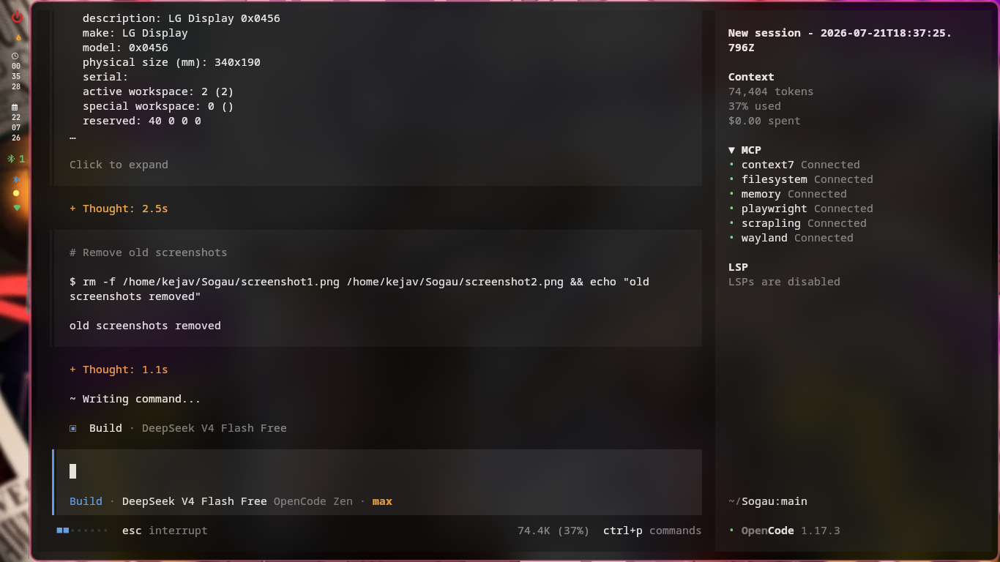
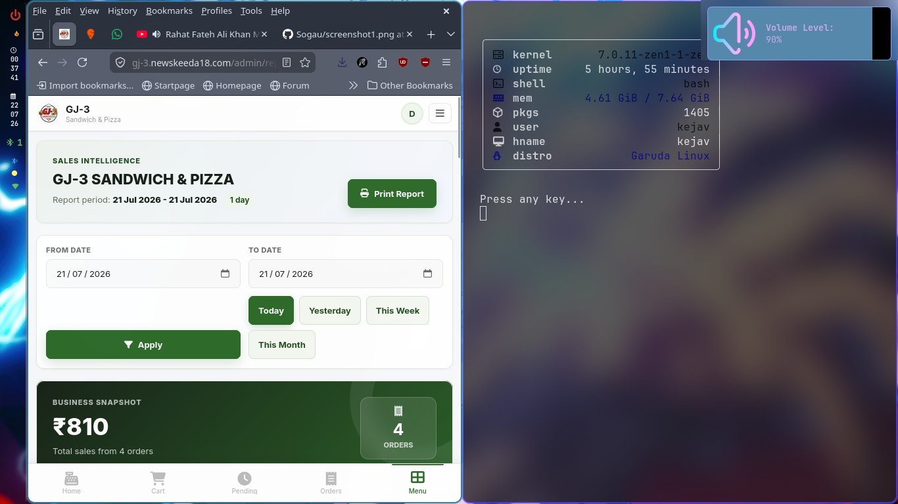
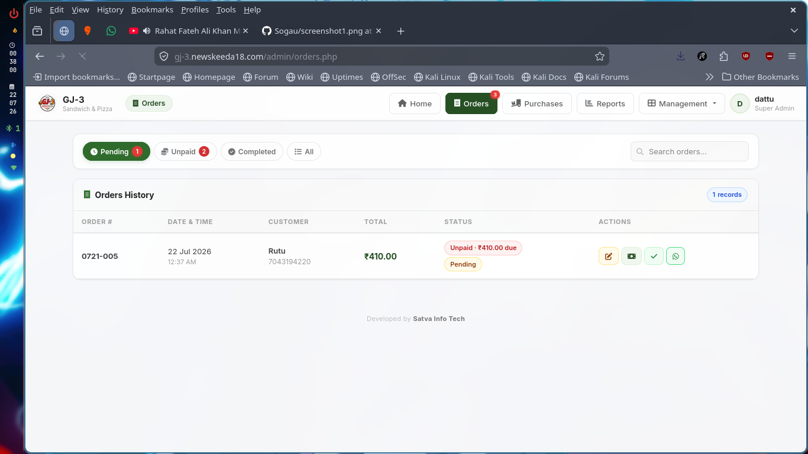

<h1 align="center">Sogau Dotfiles</h1>

<p align="center">
  <b>Hyprland · Waybar · Rofi · Kitty · Ghostty</b>
</p>

<p align="center">
  
  
</p>

---

## Screenshots

<p align="center">
  
  <em>Clean Desktop</em>
</p>

<p align="center">
  
  <em>Terminal + Fastfetch</em>
</p>

<p align="center">
  
  <em>Desktop Overview</em>
</p>

## Included Configs

| Component | Tool |
|-----------|------|
| Window Manager | Hyprland |
| Bar | Waybar |
| Launcher | Rofi |
| Terminal | Kitty / Ghostty |
| Notifications | Swaync / Mako |
| Lockscreen | Hyprlock |
| Idle Daemon | Hypridle |
| Theme/Colors | Wallust |
| GTK | GTK3 / GTK4 |
| Audio Visualizer | Cava |
| App Launcher | Fuzzel |
| Lockscreen UI | Gtklock |

## Installation

```bash
git clone git@github.com:sarojdsoka/Sogau.git
cd Sogau
./deploy.sh --link   # symlink configs to ~/.config
# or
./deploy.sh --copy   # copy configs to ~/.config
```

> **Note:** `monitors.conf` and `workspaces.conf` are machine-specific. Create them per machine after deployment.

## Structure

```
Sogau/
├── deploy.sh           # deploy configs (link or copy)
├── config/
│   ├── hypr/           # Hyprland WM, Hyprlock, Hypridle
│   ├── waybar/         # Status bar
│   ├── rofi/           # Application launcher
│   ├── kitty/          # Terminal emulator
│   ├── ghostty/        # Terminal emulator
│   ├── swaync/         # Notification center
│   ├── mako/           # Notification daemon
│   ├── gtk-3.0/        # GTK3 theme
│   ├── gtk-4.0/        # GTK4 theme
│   ├── wallust/        # Color scheme generation
│   ├── foot/           # Terminal emulator
│   ├── cava/           # Audio visualizer
│   ├── fuzzel/         # App launcher
│   └── gtklock/        # Lockscreen
└── README.md
```

## Credits

- [JaKooLit](https://github.com/JaKooLit) - Hyprland config base
- [Caelestia](https://github.com/caelestia-dots/caelestia) - Additional configs
